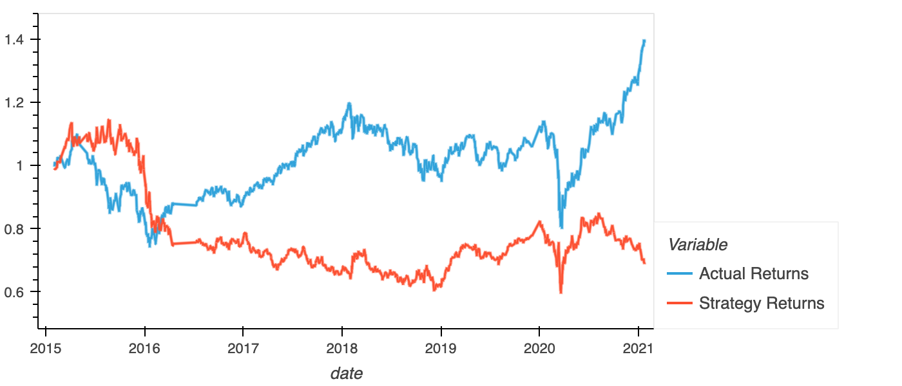
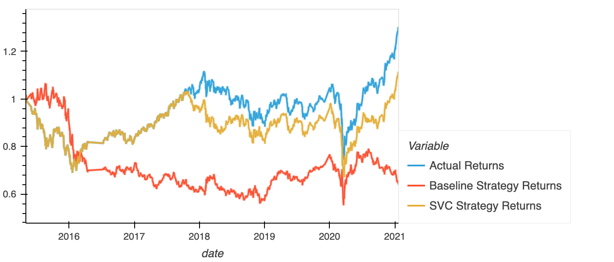
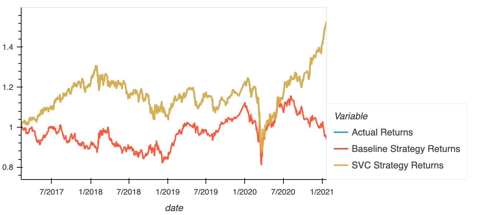
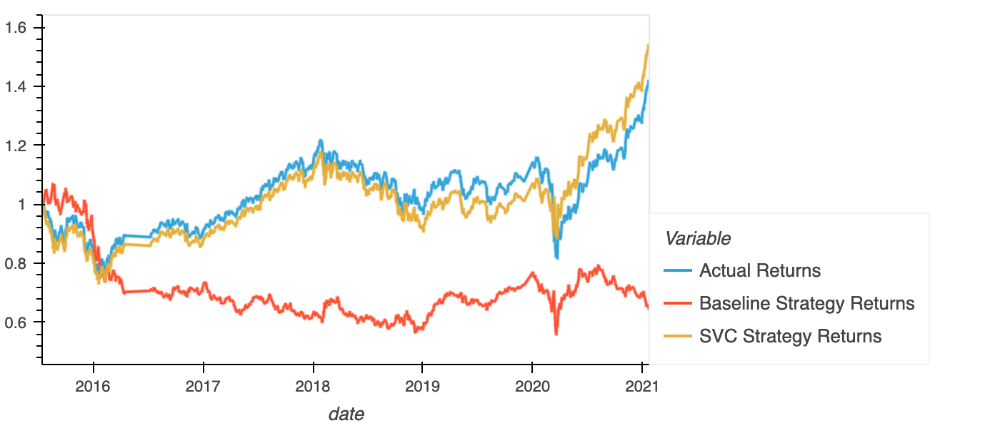
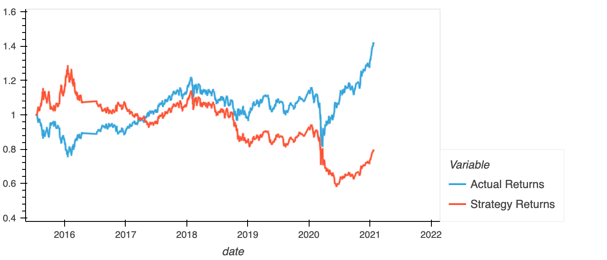
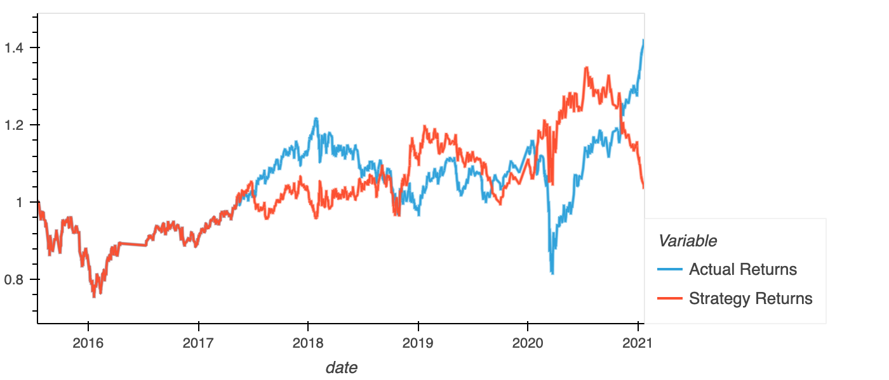

## Machine Learning Trading Bot

In this challenge, our endeavour is to create and fine tune machine learning classifier model to provide trading signals incorporating the latest available data.

Initially, we used rolling window mean returns with short window of 4 and long window of 100 to create a baseline startegy for trading signals of long when short window returns are higher than long window returns. The cumulative returns plotted for actual and baseline startegy returns showed a poor performance of the baseline startegy.

To fine tune the base model, we used the SVC classifier. First with short window of 4 and long window of 100 and a training set of 3 months data. The results for cumulative returns plotted are as under.

Next to improve on the machine learning model, we changed the training set to include 24 months of data, which resulted a over-fitted model replicating the actual returns when evaluated using the testing data. 

Later, used a short window of 4 and long window of 25 with a training set restored to 3 months of data. The result was a more refined strategy with trading signals performing better than the actual returns and much better than the baseline strategy.

In the next part of the challenge, keeping the original parameters intact with short window of 4 and long window of 100 and training data set of 3 months, we changed the classifier model first using LogisticRegression and then AdaBoost. The results were poor, with AdaBoost performing slightly better than LogisticRegression.

